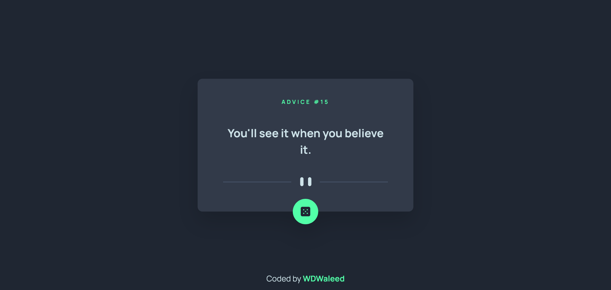
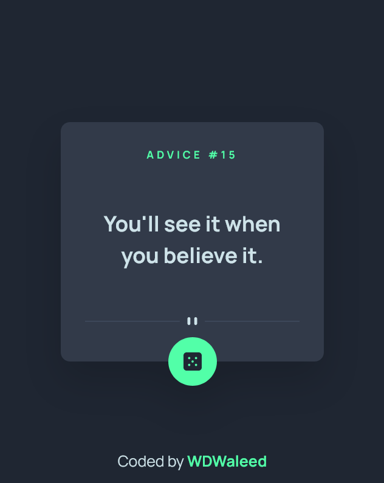

# Frontend Mentor - Advice generator app solution

This is a solution to the [Advice generator app challenge on Frontend Mentor](https://www.frontendmentor.io/challenges/advice-generator-app-QdUG-13db). Frontend Mentor challenges help you improve your coding skills by building realistic projects.

## Table of contents

- [Overview](#overview)
  - [The challenge](#the-challenge)
  - [Screenshots](#screenshots)
  - [Links](#links)
- [My process](#my-process)
  - [Built with](#built-with)
- [Author](#author)
- [Acknowledgments](#acknowledgments)

## Overview

### The challenge

Users should be able to:

- View the optimal layout for the app depending on their device's screen size
- See hover states for all interactive elements on the page
- Generate a new piece of advice by clicking the dice icon

### Screenshots
#### Desktop

#### Mobile

### Links

- Solution URL: [Netlify](https://wdwaleed-advice-generator-app.netlify.app/)
- Live Site URL: [GitHub repo](https://github.com/WDWaleed/Advice-Generator-App-Frontend-Mentor)

## My process

### Built with

- Semantic HTML5 markup
- Flexbox
- Mobile-first workflow
- [React](https://reactjs.org/) - JS library
- [TailwindCSS](https://tailwindcss.com)

## Author

- GitHub - [WDWaleed](https://github.com/WDWaleed)
- Frontend Mentor - [WDWaleed](https://www.frontendmentor.io/profile/WDWaleed)

## Acknowledgments

- [Dave Gray (My Mentor)](https://www.youtube.com/@DaveGrayTeachesCode)
